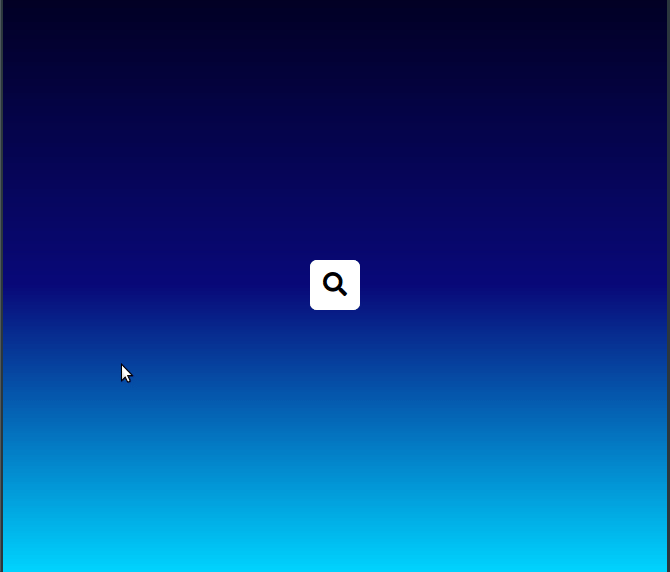

# Hidden Search Widget

Project #4 of 50 from BradTraversy's "50 Projects in 50 Days" course on Udemy.

Interact with the project yourself by [viewing the live demonstration online!](https://mdillemuth.github.io/hidden-search-widget/)

## Demo

## Description

A clever and simple interactive search bar component. When the user clicks the search-menu icon, the search bar is rendered on the screen with a small animation.

The JS is used to handle listening for the click event on the icon and toggling an active class and focusing the users mouse to the search input. CSS handles the animation and everything else.

## Technology

- HTML
  - Semantic HTML5
  - Accessibilty compliant
- CSS
  - Animation
- JavaScript
  - ES6 Syntax

## Modifications from the Original

- Improved accessibility by adding _aria-label_ to the search-icon button

## Credit

This is project #4 of 50 from Brad Traversy's [50 Projects in 50 Days: HTML, CSS, & JavaScript](https://www.udemy.com/course/50-projects-50-days/)
